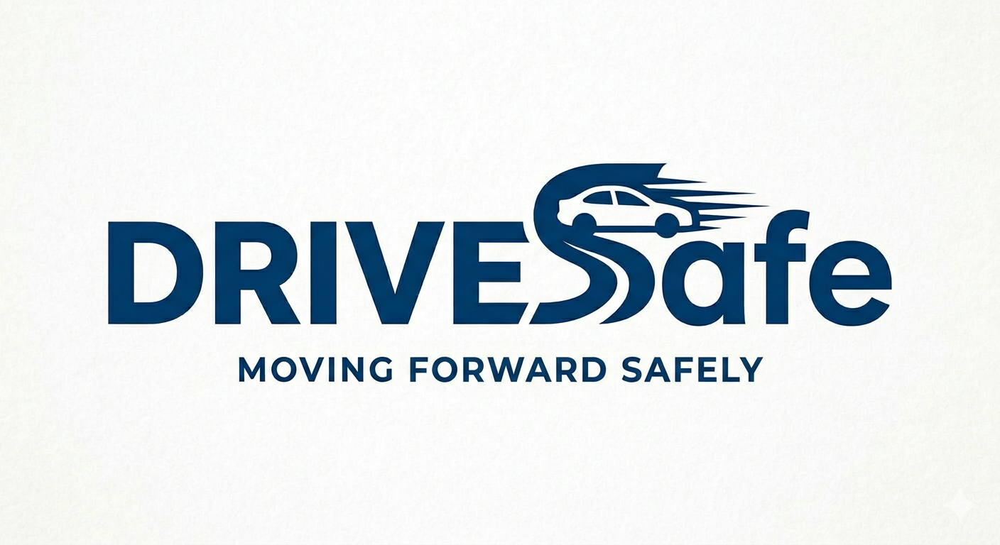

# 🚦 Traffic Sign Recognition using Deep Learning

  

## Overview
DriveSafe is a simulated autonomous vehicle company focused on improving roadway safety through AI and computer vision.
In this project, I assumed the role of an AI Engineer at the fictional autonomous vehicle company DriveSafe.
My objective was to develop a deep learning model capable of recognizing traffic signs from image data.
Accurate traffic sign recognition is an important part of autonomous driving systems. It enables cars to respond safely to traffic situations.
This project was completed as part of Machine Learning Foundations coursework and demonstrates the application of Convolutional Neural Networks (CNNs) to a real world computer vision problem.

---

## Problem Statement

Autonomous vehicles have to accurately recognize traffic signs to make safe driving decisions.
Misclassifying signs such as stop signs, speed limits, warning signs, or yield signs could lead to unsafe outcomes.

The goal of this project was to build, train, and evaluate a CNN capable of classifying traffic signs from image data.

---

## My Role
I independently designed, developed, trained, evaluated, and documented this project, including:
- problem analysis
- data prep
- model development
- hyperparameter tuning
- evaluation
- documentation
- presentation development
- and project branding

---

## Technologies Used

- Python
- TensorFlow
- Keras
- Google Colab
- CNN
- Adam Optimizer
- Dropout Layers
- Kaggle GTSRB - German Traffic Sign Recognition Benchmark Dataset

---

## Results

The final model achieved approximately **99% classification accuracy** on the test dataset using the Adam optimizer.

Key techniques included:

- Data preprocessing
- Hyperparameter tuning
- CNN architecture design
- Dropout regularization
- Model evaluation and testing

---

## Repository Structure

traffic-sign-recognition-deep-learning/
├── README.md
├── notebooks/
├── presentation/
├── media/
└── docs/

---

## Project Files

### Notebook
- notebooks/traffic_sign_recognition_deep_learning.ipynb

### Presentation
- presentation/DriveSafe_Presentation.pdf

### Media
- media/DriveSafeLogo.png
- media/demo-video-link.md

### Documentation
- docs/project-notes.md

---

## Skills Demonstrated

- Computer Vision
- Deep Learning
- Neural Network Architecture
- Model Training & Evaluation
- Hyperparameter Tuning
- Technical Documentation
- Project Presentation

---

## Acknowledgments

### Dataset
- Kaggle GTSRB - German Traffic Sign Recognition Benchmark Dataset

### Development Environment
- Google Colab

### Libraries
- TensorFlow
- Keras
- NumPy
- Pandas
- Matplotlib

### Project Assets
- Logo concept generated using Gemini
- Presentation assets created with Canva
- Narration generated with ElevenLabs

---

## Future Improvements

- Expand dataset diversity
- Add confusion matrix analysis
- Compare CNN performance with alternative architectures
- Evaluate model robustness against adversarial image attacks
- Explore cybersecurity implications of AI-based traffic sign recognition systems

